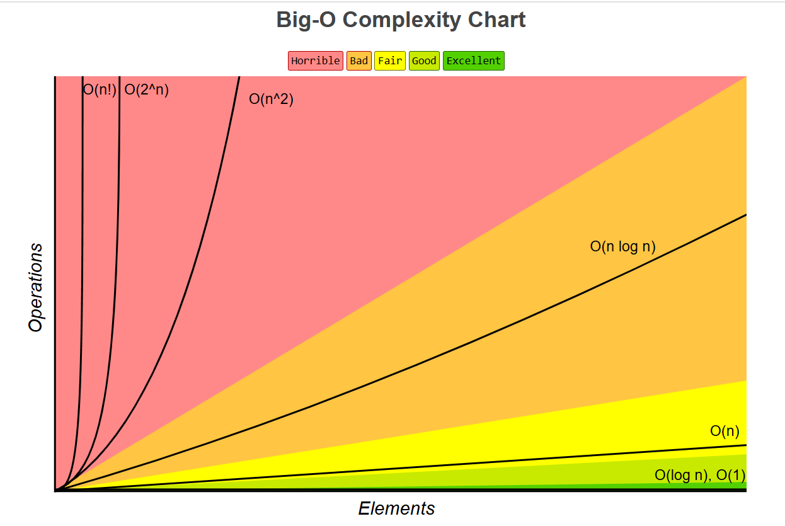

# bigo
Time complexity and BigO compendium

---
### Time Complexity

**Time complexity measures how the runtime of an algorithm grows relative to the size of its input**. 
It evaluates the **efficiency of an algorithm by counting the number of fundamental operations 
(e.g., comparisons, assignments) performed as the input size \( n \) increases**.

#### Variants of Time Complexity

1. **Best-Case Time Complexity**
    - **The minimal time** an algorithm takes **to complete under optimal conditions.**
    - Example:
      ```java
      public int findFirst(int[] arr, int x) {
          if (arr[0] == x) return 0; // Best-case: \( O(1) \) if the element is at the start.
          for (int i = 1; i < arr.length; i++) {
              if (arr[i] == x) return i;
          }
          return -1;
      }
      ```

2. **Worst-Case Time Complexity**
    - **The maximum time an algorithm can take** to complete for any input.
    - Example:
        - In the above function, if \( x \) is not present or at the last position, the complexity is \( O(n) \).

3. **Average-Case Time Complexity**
    - **The expected runtime over all possible inputs of size \( n \).**
    - Example:
        - For searching, average-case occurs **when \( x \) is in the middle of the array**. The complexity is \( O(n) \), assuming uniform distribution of \( x \)'s position.

4. **Amortized Time Complexity**
    - **Evaluates the "average runtime" per operation over a sequence of operations, even if a single operation is expensive.**
    - Example:
        - Appending elements to a **dynamic array has an amortized time complexity of \( O(1) \), though "resizing" occurs occasionally with \( O(n) \) cost.**

---
### Big-O Notation: Definition and Variants

**Big-O notation expresses the "upper bound" of an algorithm's runtime**, representing **the worst-case growth rate of an algorithm as the input size increases**.

#### Common Big-O Complexities

1. **Constant Time \( O(1) \):**
    - **Execution time is "independent of input size"**.
    - Example:
      ```java
      public int getFirstElement(int[] arr) {
          return arr[0]; // Always takes the same time.
      }
      ```

2. **Logarithmic Time \( O(\log n) \):**
    - **Execution time "increases logarithmically with input size".**
    - Example:
        - Binary Search:
          ```java
          public int binarySearch(int[] arr, int x) {
              int low = 0, high = arr.length - 1;
              while (low <= high) {
                  int mid = (low + high) / 2;
                  if (arr[mid] == x) return mid;
                  if (arr[mid] < x) low = mid + 1;
                  else high = mid - 1;
              }
              return -1;
          }
          ```

3. **Linear Time \( O(n) \):**
    - **Execution time "grows linearly with input size".**
    - ***Note `n` is the input size and `O` is the Big-O notation, i.e. "this function has a 0 of n where n is the size of the input"***
    - Example:
      ```java
      public int sumArray(int[] arr) {
          int sum = 0;
          for (int num : arr) sum += num;
          return sum;
      }
      ```

4. **Linearithmic Time \( O(n \log n) \):**
    - **Combines "linear and logarithmic growth"**.
    - Example:
        - Merge Sort, Quick Sort (average case):
          ```java
          Arrays.sort(arr); // Uses Timsort, which is O(n log n)
          ```

5. **Quadratic Time \( O(n^2) \):**
    - **Execution time "grows quadratically with input size".**
    - Example:
      ```java
      public void printPairs(int[] arr) {
          for (int i = 0; i < arr.length; i++) {
              for (int j = 0; j < arr.length; j++) {
                  System.out.println("(" + arr[i] + ", " + arr[j] + ")");
              }
          }
      }
      ```

6. **Exponential Time \( O(2^n) \):**
    - **Runtime "doubles with every additional input"**.
    - Example:
        - Solving the Traveling Salesman Problem with brute force.

7. **Factorial Time \( O(n!) \):**
    - Execution time grows as \( n \) factorial.
    - Example:
        - Generating all permutations of \( n \) elements.




---
### Relation Between Time Complexity and Big-O Notation

- **Time complexity "quantifies the exact growth of an algorithm's runtime".**
- **Big-O provides a simplified asymptotic "upper bound" for the runtime (worst case scenario)**.
- Example:
    - A nested loop that runs \( 3n^2 + 2n + 5 \) operations has a time complexity of \( O(n^2) \) (dominant term).

---
### Tools for Analyzing Big-O and Time Complexity in Java

1. **Manual Analysis in IntelliJ IDEA (Community Edition):**
    - Use comments and code inspection to identify loops and recursion.
    - Analyze the number of iterations and recursive calls.

2. **Big-O Calculation Tools:**
    - **[Big-O Calculator](https://bigocheatsheet.com):** For theoretical analysis and cheat sheets.
    - **JProfiler:** Monitors and visualizes performance bottlenecks in Java applications.

3. **Runtime Profiling:**
    - Measure execution time of code snippets:
      ```java
      long startTime = System.nanoTime();
      // Code to measure
      long endTime = System.nanoTime();
      System.out.println("Execution time: " + (endTime - startTime) + " ns");
      ```

4. **Libraries for Complexity Analysis:**
    - **Java Microbenchmark Harness (JMH):** Specifically designed for benchmarking Java code.

5. **Plugins and Extensions:**
    - IntelliJ IDEA Marketplace offers plugins like "Code Iris" to visualize code complexity.
    - Use static analysis tools (e.g., SonarLint) to identify code patterns that lead to high complexity.

---
***Example: Checking Big-O in IntelliJ IDEA***

To determine the complexity of this Java function:
```java
public int[] bubbleSort(int[] arr) {
    for (int i = 0; i < arr.length - 1; i++) {
        for (int j = 0; j < arr.length - i - 1; j++) {
            if (arr[j] > arr[j + 1]) {
                int temp = arr[j];
                arr[j] = arr[j + 1];
                arr[j + 1] = temp;
            }
        }
    }
    return arr;
}
```

1. **Manual Analysis:**
    - Outer loop: \( O(n) \)
    - Inner loop: \( O(n - i) \), leading to \( O(n^2) \).

2. **Static Analysis:**
    - Highlight and right-click to find usages or inspect code complexity.

3. **Benchmarking:**
    - Use the `System.nanoTime()` method or integrate JMH for accurate runtime analysis.

With this approach, you can systematically evaluate the performance of Java code in terms of Big-O and time complexity.

---
#### Tools for Analyzing Big-O and Time Complexity in Deep

Analyzing the time complexity and Big-O notation of existing Java code is a challenging task that often requires manual inspection and theoretical analysis. Automated tools for this purpose are limited due to the inherent difficulty in determining an algorithm's complexity programmatically. However, several approaches and tools can assist in this process:

1. **Manual Analysis**: Review your code to identify loops, recursive calls, and other constructs that influence time complexity. Understanding the algorithm's structure is crucial for determining its Big-O notation. Resources like GeeksforGeeks provide tutorials on Big-O analysis, which can be helpful.

2. **Profiling Tools**: While profilers do not directly provide Big-O complexity, they can help identify performance bottlenecks by measuring execution time and resource usage. In Java, tools like VisualVM or JProfiler can be used to monitor the performance of your code. These tools offer insights into which parts of your code consume the most time, aiding in manual complexity analysis.

3. **Empirical Analysis**: By running your code with various input sizes and measuring execution times, you can empirically determine how the runtime scales. Plotting input sizes against execution times may reveal patterns indicative of specific time complexities (e.g., linear, quadratic). This method requires careful experimentation and is not always conclusive.

4. **Static Code Analysis Tools**: Some static analysis tools can detect code patterns that may lead to inefficient performance, such as nested loops or recursive calls. While they don't provide exact Big-O notations, they can highlight areas of concern. Tools like SonarQube offer static analysis capabilities for Java code.

It's important to note that fully automated determination of an algorithm's time complexity is generally not feasible due to the undecidable nature of the problem, as discussed in various computer science literature. Therefore, combining these tools with manual analysis and a solid understanding of algorithmic principles is the most effective approach.

---
### Reference guide

[BigO Guide and Time Complexity](https://youtu.be/HfIH3czXc-8)

**BigO notation rules**

- **Better solutions consumes less time (duration) and less memory (space) and BigQ & Time Complexity provide a better understanding of the algorithm for benchmarking.** 
- **BigO notation** can objectively describe teh efficiency of code without using concrete units as it focus on the Time and Space requirements Scale (preparing for the worst case scenario so the solution is resilient).
- ***Note `n` is the input size and `O` is the Big-O notation, i.e. "this function has a 0 of n where n is the size of the input" in case of a Linear function***
- **Product Rule: If the Big Q is the product of multiple terms then drop the constant terms**, e.g.:
   ```bash
   O(4*n)       = O(n) // linear
   
   O(5 * n * n) = O(n^2) // quadratic
   
   O(765)       = O(1) // constant
   ``` 
- **Sum Rule: If the Big Q is the sum of multiple terms, only keep the largest term, drop the rest**, e.g.:
   ```bash
   O(n + 1000)            = O(n) // linear
   
   O(n^2 + n)             = O(n^2) // quadratic
   
   O(n + 500 + n^3 + n^2) = O(n^3) // cubic
   ``` 
- **Putting all together: To simplify fully, apply the Product Rule followed by the Sum Rule**, e.g.:
   ```bash
   O(5n2 + 100n + 17)     => O(n^2 + n + 1)       = O(n^2) // quadratic
   
   O((n/3)^6 + 10n)       => O(n^6 + n)           = O(n^6)
   
   O(n + 500 + n^3 + n^2) = O(n^3) // cubic
   ``` 


---
[mQUEENS SOLUTION AND OPTIMIZATION USING BIG O](./queens/src/README.md)


---
# OWASP TOP 10

Here's a brief table summarizing the OWASP Top 10 issues along with descriptions and solutions:

Here’s an updated version of the table with **Rate Limiting**, **DoS Attacks**, and **CORS** added:

| **#** | **Issue**                              | **Description**                                                                                     | **Solution & Sample**                                                                                                                                                                                                 |
|-------|----------------------------------------|-----------------------------------------------------------------------------------------------------|---------------------------------------------------------------------------------------------------------------------------------------------------------------------------------------------------------------------|
| 1     | **Broken Access Control**             | Unauthorized users accessing sensitive data or actions.                                             | Implement strict role-based access controls (RBAC).<br>**Sample**: `if (user.role != 'admin') { denyAccess() }`                                                                                                      |
| 2     | **Cryptographic Failures**            | Inadequate encryption or key management.                                                             | Use strong encryption (AES-256).<br>**Sample**: `String encrypted = encryptAES(data, key)`                                                                                                                           |
| 3     | **Injection**                          | Malicious data injected into SQL, NoSQL, etc.                                                        | Use parameterized queries to prevent SQL injection.<br>**Sample**: `SELECT * FROM users WHERE username = ? AND password = ?`                                                                                      |
| 4     | **Insecure Design**                   | Flaws in the design phase that lead to vulnerabilities.                                               | Incorporate threat modeling and security controls in design.<br>**Sample**: Design APIs with strict input validation and authentication.                                                                            |
| 5     | **Security Misconfiguration**         | Default or incomplete configurations expose the system to attacks.                                   | Disable unnecessary features, services, and ports.<br>**Sample**: `http.response.headers.remove('Server')`                                                                                                          |
| 6     | **Vulnerable and Outdated Components** | Use of outdated libraries or frameworks with known vulnerabilities.                                  | Regularly update libraries and components.<br>**Sample**: Use `npm audit` or `mvn versions:display-dependency-updates` to identify vulnerable packages.                                                             |
| 7     | **Identification and Authentication Failures** | Weak or improper authentication leading to unauthorized access.                                     | Implement multi-factor authentication (MFA) and strong password policies.<br>**Sample**: `require MFA for sensitive operations`                                                                                      |
| 8     | **Software and Data Integrity Failures** | Untrusted data used in critical processes or components.                                              | Validate all inputs and ensure code integrity with signing.<br>**Sample**: `if (!isValidData(input)) { throw new InvalidInputException() }`                                                                            |
| 9     | **Security Logging and Monitoring Failures** | Failure to log and monitor events, preventing breach detection.                                      | Implement logging of security events and real-time monitoring.<br>**Sample**: `log.info("User login attempt from IP: {}", ip)`                                                                                      |
| 10    | **Server-Side Request Forgery (SSRF)**  | Exploiting server to make requests to internal resources.                                            | Validate and sanitize URLs, disable internal network access.<br>**Sample**: `if (!isValidURL(url)) { throw new InvalidURLException() }`                                                                               |
| 11    | **Rate Limiting and DoS Protection**   | Protects against Denial of Service (DoS) and excessive requests by limiting the rate of incoming traffic. | Implement rate limiting to block excessive requests from a single source.<br>**Sample**: In Express.js: `app.use(rateLimit({ windowMs: 15 * 60 * 1000, max: 100 }))`                                                   |
| 12    | **Cross-Origin Resource Sharing (CORS) Misconfigurations** | Insecure CORS settings allowing unauthorized access to resources from other domains.                | Restrict CORS to trusted origins only.<br>**Sample**: In Node.js: `app.use(cors({ origin: ['https://trustedwebsite.com'] }))`                                                                                         |

---

# **Secure Development Lifecycle (SDL)**:

| **Stage**              | **Description**                                                                                       | **Steps**                                                                                                                  |
|------------------------|-------------------------------------------------------------------------------------------------------|----------------------------------------------------------------------------------------------------------------------------|
| **1. Training**         | Educate developers and stakeholders on security best practices.                                       | - Provide security training<br>- Awareness of security risks like OWASP Top 10                                           |
| **2. Requirements**     | Define security requirements and objectives for the project.                                          | - Identify security needs based on business requirements<br>- Define access controls and encryption requirements            |
| **3. Design**           | Incorporate security into the software architecture and design.                                       | - Perform threat modeling<br>- Design secure APIs<br>- Apply secure coding practices                                      |
| **4. Implementation**   | Implement the code with security features integrated.                                                 | - Use secure coding techniques (e.g., input validation)<br>- Employ cryptographic standards (e.g., AES)                   |
| **5. Verification**     | Test the software for security vulnerabilities.                                                      | - Perform static and dynamic analysis<br>- Conduct penetration testing<br>- Validate against security requirements         |
| **6. Release**          | Prepare for deployment, ensuring security measures are in place for production.                       | - Perform final security checks (e.g., code review, dependency check)<br>- Set up monitoring and logging for production    |
| **7. Response**         | Address security incidents and respond to vulnerabilities post-release.                               | - Monitor for breaches or security events<br>- Apply patches and updates as needed<br>- Perform incident response actions   |


---

# Functional Operations Summary

Functional programming often introduces more abstraction layers, which **may negatively impact performance**, especially in high-performance scenarios.
**Since functional operations can involve chaining, debugging becomes more complex**. Stack traces can become difficult to understand, particularly when lambdas are used.

While immutability is a core concept in functional programming, ensuring immutability in Java requires a different mindset, often leading to more boilerplate code or excessive use of final modifiers.

Here's a more comprehensive table of common stream operations in Java, with their descriptions and corresponding sample code. The **operation type** has been placed at the end for clarity.

| **Operation**         | **Description**                                             | **Sample Code** | **Operation Type** |
|-----------------------|-------------------------------------------------------------|-----------------|---------------------|
| `stream()`            | Converts a collection or other data structure into a stream for processing. | `list.stream()`  | Source              |
| `map()`               | Transforms each element of the stream by applying a function. | `stream.map(x -> x * 2)` | Intermediate         |
| `filter()`            | Filters elements based on a provided predicate.            | `stream.filter(x -> x > 10)` | Intermediate         |
| `peek()`              | Allows viewing of elements without modifying them.         | `stream.peek(System.out::println)` | Intermediate         |
| `flatMap()`           | Flattens nested streams into a single stream.              | `stream.flatMap(List::stream)` | Intermediate         |
| `distinct()`          | Returns a stream with unique elements (eliminates duplicates). | `stream.distinct()` | Intermediate         |
| `sorted()`            | Sorts the elements in the stream.                          | `stream.sorted()` | Intermediate         |
| `limit()`             | Limits the number of elements in the stream.               | `stream.limit(5)` | Intermediate         |
| `skip()`              | Skips the first `n` elements of the stream.                | `stream.skip(5)` | Intermediate         |
| `mapToInt()`          | Converts the stream of objects to an `IntStream`.           | `stream.mapToInt(String::length)` | Intermediate         |
| `mapToDouble()`       | Converts the stream of objects to a `DoubleStream`.         | `stream.mapToDouble(String::length)` | Intermediate         |
| `mapToLong()`         | Converts the stream of objects to a `LongStream`.           | `stream.mapToLong(String::length)` | Intermediate         |
| `reduce()`            | Combines the elements of the stream into a single result.  | `stream.reduce(0, Integer::sum)` | Terminal             |
| `collect()`           | Collects the stream elements into a collection (e.g., List, Set). | `stream.collect(Collectors.toList())` | Terminal             |
| `forEach()`           | Performs an action for each element of the stream.         | `stream.forEach(System.out::println)` | Terminal             |
| `toArray()`           | Converts the stream into an array.                          | `stream.toArray()` | Terminal             |
| `count()`             | Counts the number of elements in the stream.               | `stream.count()` | Terminal             |
| `anyMatch()`          | Returns `true` if any element matches the provided predicate. | `stream.anyMatch(x -> x > 10)` | Terminal             |
| `allMatch()`          | Returns `true` if all elements match the provided predicate. | `stream.allMatch(x -> x > 10)` | Terminal             |
| `noneMatch()`         | Returns `true` if no elements match the provided predicate. | `stream.noneMatch(x -> x > 10)` | Terminal             |
| `findFirst()`         | Returns the first element of the stream, if present.       | `stream.findFirst()` | Terminal             |
| `findAny()`           | Returns any element of the stream, if present.             | `stream.findAny()` | Terminal             |
| `min()`               | Returns the minimum element in the stream based on a comparator. | `stream.min(Comparator.naturalOrder())` | Terminal             |
| `max()`               | Returns the maximum element in the stream based on a comparator. | `stream.max(Comparator.naturalOrder())` | Terminal             |
| `join()`              | Joins the elements of a stream into a single string.       | `String.join(", ", stream)` | Terminal             |
| `anyMatch()`          | Returns `true` if any element matches the given predicate. | `stream.anyMatch(x -> x > 10)` | Terminal             |
| `findAny()`           | Returns any element from the stream.                       | `stream.findAny()` | Terminal             |
| `toList()`            | Collects stream elements into a `List`.                     | `stream.collect(Collectors.toList())` | Terminal             |
| `toSet()`             | Collects stream elements into a `Set`.                      | `stream.collect(Collectors.toSet())` | Terminal             |

***Explanation of Some Operations:***

- **`peek()`**: This intermediate operation allows for inspecting the elements as they pass through the pipeline without modifying the stream.
  ```java
  stream.peek(System.out::println);
  ```

- **`reduce()`**: This terminal operation combines elements in a stream using an associative accumulation function. It's often used for aggregating values such as summing elements or combining them.
  ```java
  int sum = stream.reduce(0, Integer::sum);
  ```

- **`flatMap()`**: This intermediate operation is useful for dealing with nested collections or structures. It "flattens" the stream by mapping each element to a new stream and concatenating those results into a single stream.
  ```java
  stream.flatMap(List::stream);
  ```

- **`collect()`**: A terminal operation used to collect the results of a stream into a collection or other container. It's one of the most frequently used terminal operations.
  ```java
  List<Integer> collected = stream.collect(Collectors.toList());
  ```

